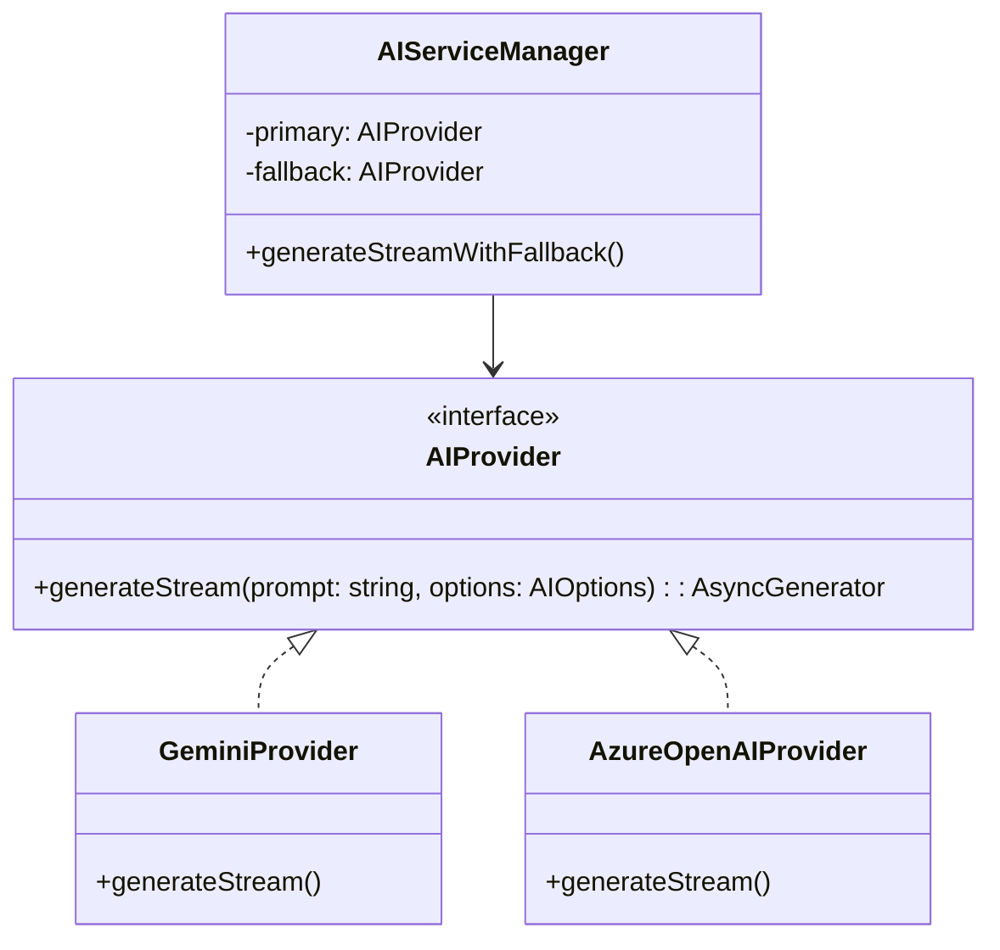

# AZURE_OPENAI_FALLBACK_PLAN.md

## 1. 概述 (Executive Summary)

本文件詳細規劃在佩璇專案 (Peixuan) 中引入 Azure OpenAI 作為 Gemini 2.5 Flash 的備援機制。目標是構建一個高可用性 (High Availability) 的 AI 服務層，當 Gemini 遇到服務不穩定 (503) 或限流 (429) 時，能無縫切換至 Azure OpenAI (GPT-4o-mini)，確保用戶體驗不中斷。

## 2. 架構設計 (Architecture Design)

### 2.1 適配器模式 (Adapter Pattern)

為了解耦具體 AI 供應商與業務邏輯，將採用標準的適配器模式：



### 2.2 備援邏輯與狀態機

1.  **Primary Attempt**: 優先調用 Gemini 2.5 Flash。
2.  **Error Detection**: 捕捉特定錯誤碼 (503 Service Unavailable, 429 Too Many Requests, Timeout)。
3.  **Fallback Trigger**: 若滿足錯誤條件且重試失敗，記錄錯誤日誌並切換至 Azure OpenAI。
4.  **Response Normalization**: 無論來源為何，統一標準化輸出流格式 (Standardized String Stream)，確保前端 SSE 解析器無需修改。

## 3. 環境變數與安全 (Configuration & Security)

基於 Cloudflare Workers 的安全最佳實踐，敏感金鑰必須透過 Secrets 管理。

### 3.1 `wrangler.jsonc` 配置 (非敏感資訊)

```jsonc
{
  "vars": {
    "AZURE_OPENAI_ENDPOINT": "https://<your-resource>.openai.azure.com/",
    "AZURE_OPENAI_DEPLOYMENT": "gpt-4o-mini", // 或其他輕量模型
    "AZURE_OPENAI_API_VERSION": "2024-08-01-preview",
    "AI_PROVIDER_TIMEOUT_MS": 25000, // Azure 通常較慢，給予適當寬限
    "ENABLE_AI_FALLBACK": true
  }
}
```

### 3.2 Secrets 管理 (敏感資訊)

需透過 `wrangler secret put` 設置：
- `AZURE_OPENAI_API_KEY`: Azure 的金鑰。
- `GEMINI_API_KEY`: (既有) Gemini 金鑰。

## 4. 實施步驟 (Implementation Steps)

### Phase 1: 基礎設施準備
1.  **定義介面**: 在 `src/types/ai.ts` 定義 `AIProvider` 介面與標準化配置型別。
2.  **配置環境**: 更新 `wrangler.jsonc` 並設置 Azure Secrets。

### Phase 2: Azure Provider 實作
1.  **建立 Service**: 新增 `src/services/ai/azureProvider.ts`。
2.  **實作串流**: 使用 `fetch` 呼叫 Azure endpoint (`/openai/deployments/{deployment-id}/chat/completions?api-version={api-version}`)。
3.  **SSE 解析**: 實作 Azure SSE 格式 (`data: {...}`) 轉純文字的解析器，對齊 Gemini 的輸出格式。
4.  **Prompt 轉換**: 將佩璇專案的純文字 Prompt 封裝為 OpenAI 格式 (`messages: [{ role: "system", ... }, { role: "user", ... }]`)。

### Phase 3: Gemini Refactoring
1.  **重構現有 Service**: 將 `src/services/geminiService.ts` 改造為 `src/services/ai/geminiProvider.ts`，實現 `AIProvider` 介面。
2.  **保留重試邏輯**: 保留現有的 `callGeminiStreamWithRetry` 作為 Provider 內部的重試機制。

### Phase 4: AI Manager 與整合
1.  **建立 Manager**: 新增 `src/services/ai/aiManager.ts`，負責 `try-catch-fallback` 邏輯。
2.  **依賴注入**: 在 Worker `Env` 中注入服務實例。
3.  **Controller 更新**: 修改 `analyzeController.ts`，將原本呼叫 `geminiService` 改為呼叫 `aiManager`。

## 5. 監控與成本控制 (Monitoring & Cost)

### 5.1 遙測 (Telemetry)
在回應的 Metadata 或 Cloudflare Logs 中記錄使用的 Provider：
- `provider: "gemini" | "azure"`
- `fallback_triggered: boolean`
- `latency_ms: number`

### 5.2 成本考量
- **Gemini 2.5 Flash**: 目前提供免費層級 (Free Tier)，付費層級極低。
- **Azure GPT-4o-mini**: 
  - Input: ~$0.15 / 1M tokens
  - Output: ~$0.60 / 1M tokens
  - 作為備援使用，成本可控。若 Gemini 長時間故障，需監控 Azure 用量警報。

## 6. 測試計畫 (Test Plan)

1.  **單元測試**:
    - 測試 Azure Provider 的 Input/Output 格式轉換。
    - 測試 AI Manager 在 Primary 失敗時是否正確呼叫 Secondary。
2.  **整合測試**:
    - 使用錯誤的金鑰或 Mock 模擬 Gemini 503，驗證系統是否自動切換至 Azure 並成功回傳串流。
    - 驗證前端接收到的 Markdown 格式在切換後是否保持一致。

## 7. 下一步行動 (Action Items)

1.  [ ] 申請 Azure OpenAI 資源並獲取 GPT-4o-mini 額度。
2.  [ ] 執行 Phase 1 代碼結構重構。
3.  [ ] 實作 Azure Provider。
4.  [ ] 進行故障切換演練。