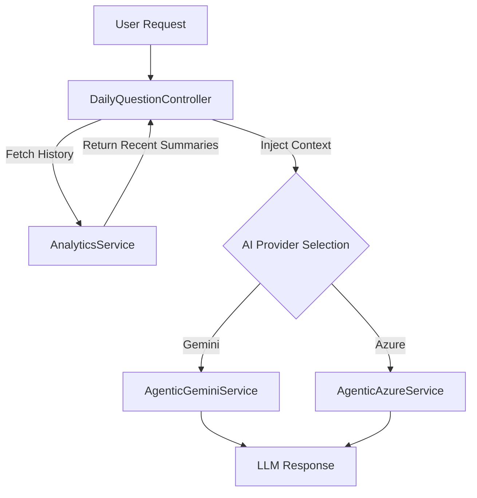

# LLM 記憶模組實作指南 (LLM Memory Module Implementation Guide)

本指南旨在基於《LLM 記憶模組產品設計評估報告》，提供具體的技術實作路徑。目標是透過**Context Injection (上下文注入)** 技術，在不大幅重構現有架構的前提下，賦予佩璇 (Peixuan) 長短期記憶能力，並確保 Gemini 與 Azure 雙引擎同步支援。

## 1. 架構設計：上下文注入管道 (Context Injection Pipeline)

我們將採用「檢索增強生成 (RAG)」的簡化版本，利用現有的 D1 資料庫與 `AnalyticsService` 作為記憶存儲層。

**流程圖:**


---

## 2. 詳細實施步驟 (Step-by-Step Implementation)

### 階段一：數據層擴展 (Data Layer Extension)

**目標：** 讓 `AnalyticsService` 有能力檢索用戶最近的對話摘要。

**修改檔案：** `peixuan-worker/src/calculation/services/analyticsService.ts`

**新增方法 `getUserRecentContext`：**

```typescript
// 在 AnalyticsService 類別中新增
export class AnalyticsService {
  // ... 既有代碼 ...

  /**
   * 獲取用戶最近的對話上下文
   * @param userId 用戶標識 (chartId 或 fingerprint)
   * @param limit 獲取的歷史條數，預設 3
   */
  async getUserRecentContext(userId: string, limit: number = 3): Promise<string> {
    try {
      // 假設 daily_question_logs 表結構包含 question 和 answer_summary (或 truncated answer)
      const logs = await this.db.select({
        question: schema.daily_question_logs.question,
        answer: schema.daily_question_logs.answer, // 注意：如果 answer 太長，需在 SQL 層截斷或在此處處理
        createdAt: schema.daily_question_logs.created_at
      })
      .from(schema.daily_question_logs)
      .where(eq(schema.daily_question_logs.user_id, userId))
      .orderBy(desc(schema.daily_question_logs.created_at))
      .limit(limit);

      if (!logs || logs.length === 0) return "";

      // 格式化為 LLM 易讀的上下文文本
      const contextText = logs.reverse().map((log, index) => {
        // 簡單摘要：只取回答的前 100 個字
        const summary = log.answer ? log.answer.substring(0, 100) + "..." : "無回答";
        return `[歷史對話 ${index + 1} - ${new Date(log.createdAt).toLocaleDateString()}]\nQ: ${log.question}\nA: ${summary}`;
      }).join("\n\n");

      return `以下是用戶過去 ${limit} 次的提問紀錄，請參考這些背景資訊來回答今日問題，以保持對話連貫性：\n${contextText}`;

    } catch (error) {
      console.error("Failed to fetch user context:", error);
      return ""; // 失敗時優雅降級，不回傳 context 即可
    }
  }
}
```

### 階段二：服務層介面更新 (Service Layer Interface Update)

**目標：** 統一 `AgenticGeminiService` 和 `AgenticAzureService` 的介面，使其能接收 `context` 參數。

**修改檔案：**
1.  `peixuan-worker/src/calculation/services/agenticGeminiService.ts`
2.  `peixuan-worker/src/calculation/services/agenticAzureService.ts`

**介面修改 (以 Gemini 為例)：**

```typescript
// 修改 generateDailyInsight 方法簽名
async generateDailyInsight(
  question: string,
  userProfile: any, // 既有參數
  historyContext: string = "" // <--- 新增參數，預設為空字串
): Promise<any> {
    // ...
}
```

**System Prompt 注入邏輯：**

在構建發送給 LLM 的 `messages` 或 `systemInstruction` 時，將 `historyContext` 插入。

```typescript
// 在 AgenticGeminiService 內部
const systemPrompt = `
你是一位精通八字與紫微斗數的命理師「佩璇」。
... (既有的 Persona 設定) ...

${historyContext ? "\n=== 用戶歷史上下文 (Memory) ===\n" + historyContext : ""}

現在，請根據用戶的提問與上述命盤資訊（以及歷史上下文），進行分析...
`;
```

*注意：AgenticAzureService 也需進行相同的修改，確保雙引擎行為一致。*

### 階段三：控制器整合 (Controller Integration)

**目標：** 在處理用戶請求時，串聯數據檢索與 AI 呼叫。

**修改檔案：** `peixuan-worker/src/calculation/controllers/dailyQuestionController.ts` (假設檔名)

```typescript
// 在處理 Daily Question 的 handler 中

// 1. 獲取用戶 ID (從 Request Header 或 Body)
const userId = req.headers.get("x-user-fingerprint") || body.chartId;

// 2. [新增步驟] 嘗試獲取歷史上下文
let historyContext = "";
if (userId) {
    try {
        // 非阻塞式呼叫？不，這裡需要等待 context，但要設定極短 timeout 避免拖慢主流程
        // 建議設定 500ms timeout，若讀不到就放棄
        historyContext = await Promise.race([
            analyticsService.getUserRecentContext(userId, 3),
            new Promise<string>(resolve => setTimeout(() => resolve(""), 500))
        ]);
    } catch (e) {
        console.warn("Context retrieval skipped:", e);
    }
}

// 3. 呼叫 AI Service，傳入 context
// 根據負載均衡或配置選擇 Provider
if (useAzure) {
    result = await agenticAzureService.generateDailyInsight(question, profile, historyContext);
} else {
    result = await agenticGeminiService.generateDailyInsight(question, profile, historyContext);
}
```

### 階段四：前端輕量優化 (Frontend Light Optimization)

雖然本次重點在後端，但前端需配合調整以支援「漸進式揭露」。

**修改檔案：** `bazi-app-vue/src/components/ChatBubble.vue`

**建議修改：**
1.  **預設摺疊 `Thinking Process`：** 如果後端回傳包含 `<thinking>` 標籤或詳細推論過程，前端 CSS 預設設為 `collapsed`，並提供一個小的 "Show Details" 按鈕。
2.  **移除雜訊：** 確保顯示給用戶的第一行字是核心結論。

---

## 3. 風險管理與降級策略

1.  **Context Window Overflow (上下文溢出)：**
    *   **風險：** 歷史紀錄過長導致超過 LLM Token 限制或增加成本。
    *   **對策：** 在 `AnalyticsService` 中嚴格限制字數 (如每則歷史紀錄截斷為 100 字)，並只取最近 3 筆。

2.  **隱私疑慮：**
    *   **風險：** 在 Prompt 中注入過多個人識別資訊。
    *   **對策：** `getUserRecentContext` 只回傳「問題」與「回答摘要」，不包含用戶的 raw data 或敏感標籤。

3.  **延遲增加：**
    *   **風險：** 多了一次 D1 資料庫查詢。
    *   **對策：** 使用 `Promise.race` 設定 500ms 超時。如果讀取記憶太慢，直接跳過，視為新對話處理，確保即時性優先於連貫性。

## 4. 驗證計畫

1.  **單元測試：** 針對 `AnalyticsService.getUserRecentContext` 撰寫測試，驗證 SQL 查詢正確且格式化輸出符合預期。
2.  **整合測試：** 模擬同一 User ID 連續發送兩次請求。第二次請求的 System Prompt 中應包含第一次的摘要 (需透過 Log 驗證)。
3.  **A/B 測試 (手動)：** 比較開啟 Memory 前後的回答品質。例如測試：「我昨天問的財運，今天還適用嗎？」開啟 Memory 後，AI 應能回答「昨天您詢問了關於投資...」。
